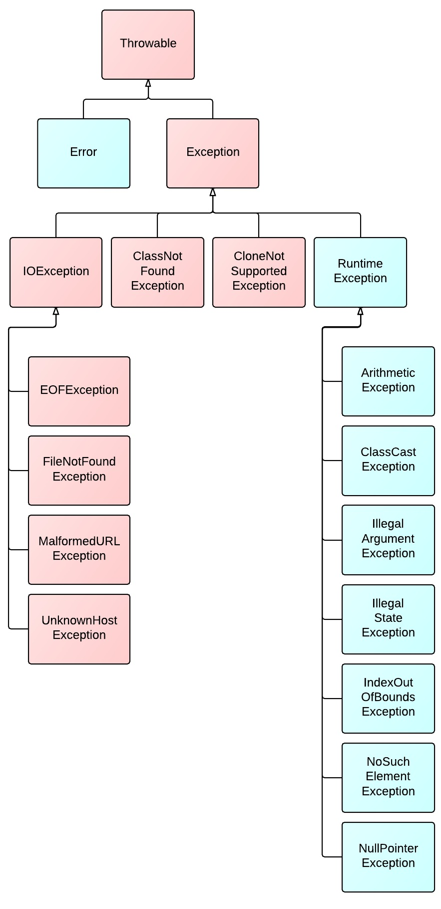

# 前言
本节内容
1. Java基础
   1. JVM,JDK,JRE,字节码，Java基本数据类型，装箱+拆箱，变量，位运算
   2. 面向对象，构造方法，接口，抽象类，String，Object
   3. Java异常，泛型，放射，IO，注解
2. Java基础常见面试题+知识点
3. 重难点：
   1. JVM
   2. IO


# 一、Java基础

## part 1

### JDK
JDK 的英文全称是 Java Development Kit。JDK是用于制作程序和Java应用程序的<font color="red">软件开发环境</font>。Java 开发人员可以在 Windows、macOS、Solaris 和 Linux 上使用，是一个跨平台编程语言。JDK 帮助他们编写和运行 Java 程序。可以在同一台计算机上安装多个 JDK 版本。

### JRE
JRE 的英文全称是 Java Runtime Environment。JRE 是一个旨在运行其他软件的软件(有点绕口)。它包含类库、加载器类和 JVM。简单来说，如果你想运行 Java 程序，你需要 JRE。如果您不是程序员，则无需安装 JDK，只需安装 JRE 即可运行 Java 程序。不过，所有 JDK 版本都与 Java Runtime Environment 捆绑在一起，因此无需在 PC 单独下载和安装 JRE。JRE 的完整形式是 Java <font color="red">运行时环境</font>。

### 字节码
在 Java 中，JVM 可以理解的代码就叫做字节码（即扩展名为 .class 的文件），它不面向任何特定的处理器，只面向虚拟机。


### 位运算

Java 中有三种移位运算符：

- <font color ="red"><<</font> :左移运算符，向左移若干位，高位丢弃，低位补零。x << 1,<font color ="red">相当于 x 乘以 2</font>(不溢出的情况下)。
- <font color ="red">>></font>:带符号右移，向右移若干位，高位补符号位，低位丢弃。正数高位补 0,负数高位补 1。x >> 1,<font color ="red">相当于 x 除以 2</font>。
- <font color ="red">>>></font> :无符号右移，忽略符号位，空位都以 0 补齐。

Java中位运算和普通运算的效率差别
```java 
public class Test10 {
    public static void main(String[] args) {
        long a=101;
        long b=1000000;
//        位运算方法
        long l1 = System.currentTimeMillis();
        for (int i = 0; i < b; i++) {
            a=a<<2;
        }
        long l2 = System.currentTimeMillis();
        System.out.println("位运算花费的时间为："+(l2-l1));
 
//        普通运算方法
        long l3 = System.currentTimeMillis();
        for (int i = 0; i < b; i++) {
            a=a*2*2;
        }
        long l4 = System.currentTimeMillis();
        System.out.println("普通运算花费的时间为："+(l4-l3));
    }
}
```
结论如下：

1、当 b=1000000级（百万级），及以下时，位运算的效率没有普通运算的效率高。

位运算花费的时间为：3
普通运算花费的时间为：2

2、当 b=10000000级（千万级）时，位运算的效率会比普通运算的效率略高。

位运算花费的时间为：6
普通运算花费的时间为：7

3、当 b=100000000级（亿级）时，位运算的效率会比普通运算的效率高。

位运算花费的时间为：43
普通运算花费的时间为：60

4、当 b=1000000000级（十亿级）时，位运算的效率会明显比普通运算的效率高。

所以在我们日常中确实普通运算的效率是足够了，但是作为一个优秀的程序员当我们处理大数据量的时候，当然还是需要学会使用位运算。

位运算花费的时间为：382
普通运算花费的时间为：558


### 变量
#### 成员变量与局部变量的区别？
- 语法形式 ：从语法形式上看，成员变量是属于类的，而局部变量是在代码块或方法中定义的变量或是方法的参数；成员变量可以被public,private,static 等修饰符所修饰，而局部变量不能被访问控制修饰符及 static 所修饰；但是，成员变量和局部变量都能被 final 所修饰。
- 存储方式 ：从变量在内存中的存储方式来看,如果成员变量是使用 static 修饰的，那么这个成员变量是属于类的，如果没有使用 static 修饰，这个成员变量是属于实例的。**而对象存在于堆内存，局部变量则存在于栈内存。**
- 生存时间 ：从变量在内存中的生存时间上看，成员变量是对象的一部分，**它随着对象的创建而存在，而局部变量随着方法的调用而自动生成，随着方法的调用结束而消亡。**
- 默认值 ：从变量是否有默认值来看，成员变量如果没有被赋初始值，则会自动以类型的默认值而赋值（一种情况例外:被 final 修饰的成员变量也必须显式地赋值），而局部变量则不会自动赋值。
  
- **静态变量**有什么作用？
静态变量可以被类的所有实例共享。**无论一个类创建了多少个对象，它们都共享同一份静态变量。**

通常情况下，静态变量会被 final 关键字修饰成为常量。

字符型常量和字符串常量的区别?
形式 : 字符常量是单引号引起的一个字符，字符串常量是双引号引起的 0 个或若干个字符。
含义 : 字符常量相当于一个整型值( ASCII 值),可以参加表达式运算; 字符串常量代表一个地址值(该字符串在内存中存放位置)。
占内存大小 ： 字符常量只占 2 个字节; 字符串常量占若干个字节。
(注意： char 在 Java 中占两个字节)

---

- 静态方法为什么不能调用非静态成员?
这个需要结合 JVM 的相关知识，主要原因如下：

>静态方法是属于类的，在类加载的时候就会分配内存，可以通过类名直接访问。而非静态成员属于实例对象，只有在对象实例化之后才存在，需要通过类的实例对象去访问。
在类的非静态成员不存在的时候静态方法就已经存在了，此时调用在内存中还不存在的非静态成员，属于非法操作。
静态方法和实例方法有何不同？

- 1、调用方式

在外部调用静态方法时，可以使用 类名.方法名 的方式，也可以使用 对象.方法名 的方式，而实例方法只有后面这种方式。也就是说，调用静态方法可以无需创建对象 。

不过，需要注意的是一般不建议使用 对象.方法名 的方式来调用静态方法。这种方式非常容易造成混淆，静态方法不属于类的某个对象而是属于这个类。

因此，一般建议使用 类名.方法名 的方式来调用静态方法。


- 2、访问类成员是否存在限制

静态方法在访问本类的成员时，只允许访问静态成员（即静态成员变量和静态方法），不允许访问实例成员（即实例成员变量和实例方法），而实例方法不存在这个限制。


### 基本数据类型


>注意：
Java 里使用 long 类型的数据一定要在数值后面加上 L，否则将作为整型解析。
char a = 'h'char :***单引号***，String a = "hello" :***双引号。***
这八种基本类型都有对应的包装类分别为：Byte、Short、Integer、Long、Float、Double、Character、Boolean 。

### 装箱+拆箱
一. 基本类型和包装类型的区别？
- 成员变量包装类型不赋值就是 null ，而基本类型有默认值且不是 null。
- 包装类型可用于泛型，而基本类型不可以。
- 基本数据类型的局部变量存放在 Java 虚拟机栈中的局部变量表中，基本数据类型的成员变量（未被 static 修饰 ）存放在 Java 虚拟机的堆中。包装类型属于对象类型，我们知道几乎所有对象实例都存在于堆中。
- 相比于对象类型， 基本数据类型占用的空间非常小。


2. 包装类型的缓存机制了解么？
Java 基本数据类型的包装类型的大部分都用到了**缓存机制来提升性能**。

Byte,Short,Integer,Long 这 4 种包装类默认创建了数值 [-128，127] 的相应类型的缓存数据，Character 创建了数值在 [0,127] 范围的缓存数据，Boolean 直接返回 True or False。

常见的面试题，看返回结果
```java
   public static void main(String[] args) {
        System.out.println("(Integer)129 == (Integer)129");
        System.out.println( (Integer)129 == (Integer)129);
        System.out.println("(Integer)127 == (Integer)127");
        System.out.println((Integer)127 == (Integer)127);
    }


>>>>>>返回结果 
(Integer)129 == (Integer)129
false
(Integer)127 == (Integer)127
true
```
> 上述原因
> 如果超出对应范围仍然会去创建新的对象，缓存的范围区间的大小只是在性能和资源之间的权衡。==在对象中比较的是内存地址，所以false
>

---

```java
Integer i1 = 40;
Integer i2 = new Integer(40); // 主要原因是装箱了也是一个新地址
System.out.println(i1==i2);

同样返回false
```

究其原因：
1：==比的是内存地址
2：包装类型的装箱和拆箱


二. 自动装箱与拆箱了解吗？原理是什么？
什么是自动拆装箱？

装箱：将基本类型用它们对应的引用类型包装起来；
拆箱：将包装类型转换为基本数据类型；
```java
Integer i = 10;  //装箱
int n = i;   //拆箱

```
**注意：如果频繁拆装箱的话，也会严重影响系统的性能。我们应该尽量避免不必要的拆装箱操作。**

### JVM
-- 重点
#### 1.Java内存区域
- 运行时数据区域 JDK1.8之后


**看一下JavaGuide大佬的图，更为清晰**


<font color="red">
1.线程共享：堆；方法区

2.线程私有（每个线程都会有一份）：虚拟机栈；方法栈；程序计数器
</font>

1. **程序计数器**
   1. 线程私有
   2. 占据的内存空间小
   3. 记录每个线程代码执行到的行号，保证在线程上下文切换之后，依旧能找到对应的位置继续向下执行。所以也决定了程序计数器是每个线程私有的。
   4. 生命周期是随着线程的创建而创建，线程的消亡而消亡。
2. **堆**：
   1. Java内存中最大的一块区域，是供所有线程共享的一块区域。
   2. 对象实例、数组都会在这分配地址。<font color="reed">【不是所有的对象都在堆中，未逃逸的对象才会在堆中(逃逸分析原则：某些方法中的**对象引用没有被返回**或者**未被外面使用**)】</font>
```java
// 外部使用逃逸，可以分配在栈中
public class ObjectEscape{ 
    private User user; 
    public void init(){ 
        user = new User(); 
    } 
} 

// return返回逃逸，可以分配到栈中
public class ObjectReturn{ 
    public User createUser(){ 
        User user = new User(); 
        return user; 
    } 
} 
```
**逃逸分析的优点**：


**堆结构（对于1.8之后的结构进行理解）**：

一个小对象的历程：Eden=》一次youngGC=》S1=》S2（对象年龄+1）【到15岁晋升到老年代】
hotspot优化：Hotspot 遍历所有对象时，按照年龄从小到大对其所占用的大小进行累积，当累积的某个年龄大小超过了 survivor 区的一半时，取这个年龄和 MaxTenuringThreshold 中更小的一个值，作为新的晋升年龄阈值

3. 元空间（1.8之后将永久代替换成元空间【方法区的具体实现】）
   1. 方法区会存储已被虚拟机加载的 **类信息、字段信息、方法信息、常量、静态变量、即时编译器编译后的代码缓存等**数据。
   2. 元空间使用内存的原因：jvm使用大小的限制的，使用内存最大程度上减小了限制
4. **运行时常量池**（1.8之前有，之后也在元空间）
5. **字符串常量池**
   1. 避免字符串的重复创建，提升jvm性能和减少内存消耗
   
    
6. **本地方法栈**：和虚拟机栈所发挥的作用非常相似，区别是： 虚拟机栈为虚拟机执行 Java 方法 （也就是字节码）服务，而本地方法栈则为虚拟机使用到的<font color="reed"> Native 方法服务</font>
7. **虚拟机栈**
   1. 线程私有
   2. 每次方法调用的时候，方法会入栈，方法执行结束弹出栈。与数据结构中的栈相似
   3. 每个栈是一个栈帧构成
   
      1.  **局部变量**：各种数据类型（int，char等）；对象引用（可能指向对象其实地址的引用指针；可能指向代表这个对象的句柄）
        
       2. **操作数栈**：操作数据的地方，可以理解成加工厂，做加减乘除的地方。计算时的临时变量也会存放在操作数栈中。
   
       3. **动态链接**：一个方法调用其他方法的场景。java文件编译成Class文件中的常量池就有大量的符号引用。当一个方法调用其他方法的时候，<font color="red">将符号引用转化成直接引用</font>.(**符号引用**：当Java文件在编译的时候并不知道引用的实际地址，只能用符号引用来代替。比如com.future.A中引用了com.future.B；A并不知B的实际位置，只能通过符号com.future.B来表示；**直接引用**:直接指向目标的指针)
        
>程序运行中栈可能会出现两种错误：
StackOverFlowError： 若栈的内存大小不允许动态扩展，那么当线程请求栈的深度超过当前 Java 虚拟机栈的最大深度的时候，就抛出 StackOverFlowError 错误。
OutOfMemoryError： 如果栈的内存大小可以动态扩展， 如果虚拟机在动态扩展栈时无法申请到足够的内存空间，则抛出OutOfMemoryError异常。


---

#### Hotspot对象

##### 对象的创建：
1. **类加载检查**：遇到new 指令，首先检查常量池中是不是已经有这个类的符号引用，并检查符号引用的类是不是被加载过。如果没有，必须先执行类加载过程（双亲委派加载过程）
2. **分配内存**：从Java堆中划分一块空间给对象。分配方式有两种指针碰撞和空闲列表。
   1. **指针碰撞**：
   
      1. 适用的场景：内存空间规整（没有碎片的情况下）
      2. 原理：将有过的内存全部整合到一边，没用过的在另一边，来一个一个对象就划一块空间即可。
      3. GC收集器：ParNew，Serial
   2. **空闲列表**
      1. 适用场景：空间为碎片的情况下
      2. 原理：虚拟机维护一个列表，列表中记录着用和不用的内存块，分配的时候直接找一块够大的就行
      3. GC收集器：CMS
   <font color="red">以上的两种分配内存的方式，主要取决于内存是否完整</font>
3. **初始化零值**：将分配到的内存空间都分配到零值（不包括全请求头），为了保证不赋值也能直接使用。
4. **设置对象头**：将元信息，对象和哈希码，GC分代年龄放到对象头。还有是否使用偏向锁，锁状态的信息等
   
5. **执行init方法**
   
##### 对象的内存布局
在 Hotspot 虚拟机中，对象在内存中的布局可以分为 3 块区域：<font color="reed">对象头、实例数据和对齐填充</font>。

Hotspot 虚拟机的对象头包括两部分信息，第一部分用于存储对象自身的运行时数据（哈希码、GC 分代年龄、锁状态标志等等），另一部分是类型指针，即对象指向它的类元数据的指针，虚拟机通过这个指针来确定这个对象是哪个类的实例。

实例数据部分是对象真正存储的有效信息，也是在程序中所定义的各种类型的字段内容。

对齐填充部分不是必然存在的，也没有什么特别的含义，仅仅起占位作用。 因为 Hotspot 虚拟机的自动内存管理系统要求对象起始地址必须是 8 字节的整数倍，换句话说就是对象的大小必须是 8 字节的整数倍。而对象头部分正好是 8 字节的倍数（1 倍或 2 倍），因此，当对象实例数据部分没有对齐时，就需要通过对齐填充来补全。


        

## part2
### 面向对象 
总体来说面向对象的东西太过于理论，以我个人的理解就是：
1. 万物皆是对象
2. 面向对象编程
3. 面向对象会先抽象出对象，然后用对象执行方法的方式解决问题。
4. 面向对象+设计模式=更容易维护和扩展

---
### 面向对象三大特征
1. 封装
封装是指把一个对象的状态信息（也就是属性）隐藏在对象内部，不允许外部对象直接访问对象的内部信息。但是可以提供一些可以被外界访问的方法来操作属性。这也是安全性上的考虑。

```java
public class Student {
    private int id;//id属性私有化
    private String name;//name属性私有化

    //获取id的方法
    public int getId() {
        return id;
    }

    //设置id的方法
    public void setId(int id) {
        this.id = id;
    }

    //获取name的方法
    public String getName() {
        return name;
    }

    //设置name的方法
    public void setName(String name) {
        this.name = name;
    }
}
```
2. 继承
   
关于继承如下 3 点请记住：

1. 子类拥有父类对象所有的属性和方法（包括私有属性和私有方法），但是父类中的私有属性和方法子类是无法访问，只是拥有。
2. 子类可以拥有自己属性和方法，即子类可以对父类进行扩展。
3. 子类可以用自己的方式实现父类的方法。（以后介绍）。

4. 多态
多态，顾名思义，表示一个对象具有多种的状态，具体表现为父类的引用指向子类的实例。
使用中无非就是向上转型和向下转型，要会优雅的使用设计模式，那一定要深度的理解多态。

### 构造方法

### 接口；抽象类

接口和抽象类有什么共同点和区别？
共同点 ：

1. 都不能被实例化。
2. 都可以包含抽象方法。
3. 都可以有默认实现的方法（Java 8 可以用 default 关键字在接口中定义默认方法）。
区别 ：

1. 接口主要用于对类的行为进行约束，你实现了某个接口就具有了对应的行为。抽象类主要用于代码复用，强调的是所属关系。
2. 一个类只能继承一个类，但是可以实现多个接口。
3. 接口中的成员变量只能是 public static final 类型的，不能被修改且必须有初始值，而抽象类的成员变量默认 default，可在子类中被重新定义，也可被重新赋值。

### 深拷贝和浅拷贝
关于深拷贝和浅拷贝区别，我这里先给结论：

**浅拷贝**：浅拷贝会在堆上创建一个新的对象（区别于引用拷贝的一点），不过，如果原对象内部的属性是引用类型的话，浅拷贝会直接复制内部对象的引用地址，也就是说拷贝对象和原对象共用同一个内部对象。
**深拷贝** ：深拷贝会完全复制整个对象，包括这个对象所包含的内部对象。


---

### Object
万物皆对象。

>常见的问题
1. == 和 equals() 的区别
- 基本数据类型 ==比较的是值
- 引用数据类型 ==比较的是内存地址

2. equals() 方法存在两种使用情况：
- 类没有重写 equals()方法 ：通过equals()比较该类的两个对象时，等价于通过“==”比较这两个对象，使用的默认是 Object类equals()方法。
- 类重写了 equals()方法 ：一般我们都重写 equals()方法来比较两个对象中的**属性是否相等**；若它们的属性相等，则返回 true(即，认为这两个对象相等)。*最常见的我们可以去看String中的equals方法，就是重写之后的*

3. hashCode() 有什么用？
散列表存储的是键值对(key-value)，它的特点是：能根据“键”快速的检索出对应的“值”。这其中就利用到了散列码！（可以快速找到所需要的对象）。<font color="red">hashMap的流程了解一下就知道了，先hashCode散列，然后equals比较。</font>


4. 为什么重写 equals() 时必须重写 hashCode() 方法？
   
因为两个相等的对象的 hashCode 值必须是相等。也就是说如果 equals 方法判断两个对象是相等的，那这两个对象的 hashCode 值也要相等。

如果重写 equals() 时没有重写 hashCode() 方法的话就可能会导致 equals 方法判断是相等的两个对象，hashCode 值却不相等。

>如果只重写了 equals 方法，那么默认情况下，Set 进行去重操作时，会先判断两个对象的 hashCode 是否相同，此时因为没有重写 hashCode 方法，所以会直接执行 Object 中的 hashCode 方法，而 Object 中的 hashCode 方法对比的是<font color="red">两个**不同引用地址**的对象，所以结果是 false</font>，那么 equals 方法就不用执行了，直接返回的结果就是 false：两个对象不是相等的，于是就在 Set 集合中插入了两个相同的对象。
但是，如果在重写 equals 方法时，<font color="red">也重写了 hashCode 方法，那么在执行判断时会去执行重写的 hashCode 方法，此时对比的是两个对象的**所有属性**的 hashCode 是否相同，于是调用 hashCode 返回的结果就是 true</font>，再去调用 equals 方法，发现两个对象确实是相等的，于是就返回 true 了，因此 Set 集合就不会存储两个一模一样的数据了，于是整个程序的执行就正常了。

### String
1. String、StringBuffer、StringBuilder 的区别？


2. String 不可变

- String 是final修饰的，导致不能被继承，避免了子类的干预
- 存放字符串的数组是final的同时private修饰且为提供公有方法set value这个属性，这三个因素同时避免了修改


以上是Java8的源码，Java9有变化的点。Java 9 为何要将 String 的底层实现由 char[] 改成了 byte[] ?

byte 占一个字节(8 位)，char 占用 2 个字节（16），byte 相较 char 节省一半的内存空间。

3. 字符串常量池的作用了解吗？
字符串常量池 是 JVM 为了提升性能和减少内存消耗针对字符串（String 类）专门开辟的一块区域，主要目的是为了避免字符串的重复创建。
```java
// 在堆中创建字符串对象”ab“
// 将字符串对象”ab“的引用保存在字符串常量池中
String aa = "ab";
// 直接返回字符串常量池中字符串对象”ab“的引用
String bb = "ab";
System.out.println(aa==bb);// true

步骤如下：
1. 检查字符串缓存池中有没有对应的字符串
2. 有直接返回
3. 没有创建2个新的对象，一个放堆中，一个放字符串常量池
```
经典面试：String s1 = new String("abc");这句话创建了几个字符串对象？
1、如果字符串常量池中不存在字符串对象“abc”的引用，那么会在堆中创建 2 个字符串对象“abc”。
分别放在堆中和字符串缓存池中。

2、如果字符串常量池中已存在字符串对象“abc”的引用，则只会在堆中创建 1 个字符串对象“abc”。

## part3

### Java异常


**异常使用有哪些需要注意的地方？**
- 不要把异常定义为静态变量，因为这样会导致异常栈信息错乱。每次手动抛出异常，**我们都需要手动 new 一个异常对象抛出**。
- 抛出的异常信息**一定要有意义**。
- 建议抛出更加具体的异常比如字符串转换为数字格式错误的时候应该抛出NumberFormatException而不是其父类IllegalArgumentException。
- 使用**日志打印异常之后就不要再抛出异常了**（**两者不要同时**存在一段代码逻辑中）。

### 泛型 
>泛型一般有三种使用方式:**泛型类**、**泛型接口**、**泛型方法**。

1. 泛型类
```java
//此处T可以随便写为任意标识，常见的如T、E、K、V等形式的参数常用于表示泛型
//在实例化泛型类时，必须指定T的具体类型
public class Generic<T>{

    private T key;

    public Generic(T key) {
        this.key = key;
    }

    public T getKey(){
        return key;
    }
}
```

2. 泛型接口
```java
public interface Generator<T> {
    public T method();
}

```

实现泛型接口，不指定类型：
```java
class GeneratorImpl<T> implements Generator<T>{
    @Override
    public T method() {
        return null;
    }
}

```

实现泛型接口，指定类型：
```java
class GeneratorImpl<T> implements Generator<String>{
    @Override
    public String method() {
        return "hello";
    }
}
```

3. 泛型方法
```java
   public static < E > void printArray( E[] inputArray )
   {
         for ( E element : inputArray ){
            System.out.printf( "%s ", element );
         }
         System.out.println();
    }
```

### 反射
>如果说大家研究过框架的底层原理或者咱们自己写过框架的话，一定对反射这个概念不陌生。反射之所以被称为框架的灵魂，主要是因为它赋予了我们在运行时分析类以及执行类中方法的能力。通过反射你可以获取任意一个类的所有属性和方法，你还可以调用这些方法和属性。
其实在看Spring中的源码的时候我们特别能有体会的就是，在创建bean的时候就会使用到反射来判断类的结构来构建bean放到容器中。

想要仔细的了解反射，可以去看一下Spring中的反射工具类。


1. 反射的应用场景？
像咱们平时大部分时候都是在写业务代码，很少会接触到直接使用反射机制的场景。但是！这并不代表反射没有用。相反，正是因为反射，你才能这么轻松地使用各种框架。像 Spring/Spring Boot、MyBatis 等等框架中都大量使用了反射机制。

这些框架中也大量使用了动态代理，而动态代理的实现也依赖反射。

比如下面是通过 JDK 实现动态代理的示例代码，其中就使用了反射类 Method 来调用指定的方法。


### 注解
Annotation （注解） 是 Java5 开始引入的新特性，可以看作是一种特殊的注释，主要用于修饰类、方法或者变量，提供某些信息供程序在编译或者运行时使用。
比较装B的一种写法，尽量不要强行套用。


### 序列化和反序列化
简单来说：

- 序列化： 将数据结构或对象转换成二进制字节流的过程
- 反序列化：将在序列化过程中所生成的二进制字节流转换成数据结构或者对象的过程


### IO
1. IO流基础


可参考[JavaGuide-IO基础](https://github.com/Snailclimb/JavaGuide/blob/main/docs/java/io/io-basis.md)
2. IO流中的设计模式
- 装饰者模式

我们可以通过 BufferedInputStream（字节缓冲输入流）来增强 FileInputStream 的功能。

```java
public BufferedInputStream(InputStream in) {
    this(in, DEFAULT_BUFFER_SIZE);
}

public BufferedInputStream(InputStream in, int size) {
    super(in);
    if (size <= 0) {
        throw new IllegalArgumentException("Buffer size <= 0");
    }
    buf = new byte[size];
}

```

- 观察者模式

NIO 中的文件目录监听服务使用到了观察者模式。

NIO 中的文件目录监听服务基于 WatchService 接口和 Watchable 接口。WatchService 属于观察者，Watchable 属于被观察者。


---

3. IO 模型
   

>先从计算机结构的角度来解读一下 I/O。
根据冯.诺依曼结构，计算机结构分为 5 大部分：运算器、控制器、存储器、输入设备、输出设备。 
为了保证操作系统的稳定性和安全性，一个进程的地址空间划分为 用户空间（User space） 和 内核空间（Kernel space ） 。像我们平时的应用程序都是使用的用户空间，再IO操作的时候。**应用程序对操作系统的内核发起 IO 调用（系统调用），操作系统负责的内核执行具体的 IO 操作。也就是说，我们的应用程序实际上只是发起了 IO 操作的调用而已，具体 IO 的执行是由操作系统的内核来完成的。**
当应用程序发起 I/O 调用后，会经历两个步骤：
a. 内核等待 I/O 设备准备好数据
b. 内核将数据从内核空间拷贝到用户空间。


- 常见的IO模型
IO 模型一共有 5 种： 同步阻塞 I/O、同步非阻塞 I/O、I/O 多路复用、信号驱动 I/O 和异步 I/O。

这也是我们经常提到的 5 种 IO 模型。


---

以下常见的三种

- BIO（Blocking I/O）**BIO 属于同步阻塞 IO 模型** 
>同步阻塞 IO 模型中，应用程序发起 read 调用后，会一直阻塞，**直到内核把数据拷贝到用户空间**。


当面对十万甚至百万级连接的时候，传统的 BIO 模型是无能为力的。因此，我们需要一种更高效的 I/O 处理模型来应对更高的并发量。


- NIO (Non-blocking/New I/O)  **同步非阻塞 IO 模型。**
>Java 中的 NIO 于 Java 1.4 中引入，对应 java.nio 包，提供了 Channel , Selector，Buffer 等抽象。NIO 中的 N 可以理解为 Non-blocking，不单纯是 New。它是支持面向缓冲的，基于通道的 I/O 操作方法。 对于高负载、高并发的（网络）应用，应使用 NIO 。
Java 中的 NIO 可以看作是 **I/O 多路复用模型**


>当将数据从内核拷贝到应用程序的时候是阻塞的，其他的环境是一直调用read的。
相比于同步阻塞 IO 模型，同步非阻塞 IO 模型确实有了很大改进。通过轮询操作，避免了一直阻塞。
<font color="red">这种 IO 模型同样存在问题：应用程序不断进行 I/O 系统调用**轮询**数据是否已经准备好的过程是十分**消耗 CPU 资源**的。</font>
---
因此引出了多路复用这个模型


- 1.先查询内核是否把数据准备好
- 2.内核返回准备好，发起read调用
- 3.内核数据拷贝到应用程序时阻塞
  
优化了NIO不停轮询造成的IO开销，IO 多路复用模型，通过减少无效的系统调用，减少了对 CPU 资源的消耗。

---
NIO 选择器 ( Selector )  多路复用器。
只需要一个线程便可以管理多个客户端连接。当客户端数据到了之后，才会为其服务。


Selector(选择器)是 Java NIO 中能够检测到一到多个 NIO 通道，并能够知道通道**是否为读写事件做好准备**。这样，一个单独的线程可以管理多个 Channel，从而**管理多个网络连接**。仅用单个线程来处理多个 Channel 的好处是，只需要更少的线程来处理通道。事实上，可以只用一个线程处理所有的通道。对于操作系统来说，**线程之间上下文切换**的**开销很大**，而且每个线程都要占用系统的一些资源（如内存）。因此，使用的**线程越少越好**。但是，现代的操作系统和 CPU 在多任务方面表现的越来越好，所以多线程的开销随着时间的推移，变得越来越小了。实际上，如果一个 CPU 有多个内核，不使用多任务可能是在浪费CPU 能力，暴殄天物。在这里主要了解通过 Selector 处理多个通道。
[大佬解释方法](https://blog.csdn.net/yhl_jxy/article/details/79332092)


---

- AIO (Asynchronous I/O) **异步 IO 模型**
>**异步 IO 是基于事件和回调机制实现的**。BIO和NIO在内核数据拷贝到应用程序的时候都是阻塞的，在AIO的时候这里就做了相应的优化。并不会阻塞在这里，而是操作系统会通知对应的线程去执行后续的操作。


注:
目前来说 AIO 的应用还不是很广泛。Netty 之前也尝试使用过 AIO，不过又放弃了。这是因为，Netty 使用了 AIO 之后，在 Linux 系统上的性能并没有多少提升。


- 总结BIO/NIO/AIO


