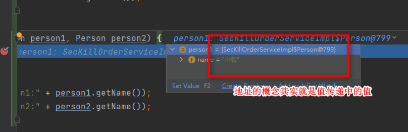

# 问题
1. 为什么Java中只使用值传递
2. 形参和实参到底是什么？
3. 值传递和引用传递到底是什么？


# 形参、实参
- 形参：用于定义方法/函数传递的参数，不需要有确定的值（搞搞形式主义，你传给我就行）
- 实参：传递给函数/方法的参数，必须有实际的值（记忆：实际的，实打实的值）

```java
private int a = 1;
// a 为实参
printVal(a);
// val 为形参
void printVal(int val){
    System.out.print(val);
}
```


# 值传递、引用传递
- 值传递：方法接受到实参的时候，会创建一个副本，然后进行传递
- 引用传递：方法接受到的是实参的对象在堆中的地址，那当我们在修改形参的时候就会改变实参
<font color="red">Java中只有值传递</font>


# 为什么Java是值传递

```java
public static void main(String[] args) {
        int num1 = 10;
        int num2 = 20;
        swap(num1, num2);
        System.out.println("num1 = " + num1);
        System.out.println("num2 = " + num2);
    }

    public static void swap(int a, int b) {
        int temp = a;
        a = b;
        b = temp;
        System.out.println("a = " + a);
        System.out.println("b = " + b);
    }

===>输出
a = 20
b = 10
num1 = 10
num2 = 20

/*说明并没有改变num1和num2(实参)；因为是值传递所以，ab（形参）的变动并不会影响到他们*/
```
<font color="reed">一个方法不能修改一个**基本数据类型**的参数，而对象引用作为参数就不一样</font>

如图 debug 就是值传递


----

```java
 public static void main(String[] args) {
        int[] arr = { 1, 2, 3, 4, 5 };
        System.out.println(arr[0]);
        change(arr);
        System.out.println(arr[0]);
    }

    public static void change(int[] array) {
        // 将数组的第一个元素变为0
        array[0] = 0;
    }


/*
    也就是说 change 方法的参数拷贝的是 arr （实参）的地址，因此，它和 arr 指向的是同一个数组对象。这也就说明了为什么方法内部对形参的修改会影响到实参。*/
```


如图 debug 传递的是地址（其实这里表示的并不是引用传递，还是值传递【**这个值是地址罢了(这个比较绕，看下面)**】）

swap 方法的参数 person1 和 person2 只是拷贝的实参 xiaoZhang 和 xiaoLi 的地址。因此， person1 和 person2 的互换只是拷贝的两个地址的互换罢了，并不会影响到实参 xiaoZhang 和 xiaoLi 。


---

```java
public static class Person {
        private String name;


        public Person(String name) {
            this.name = name;
        }

        public String getName() {
            return name;
        }

        public void setName(String name) {
            this.name = name;
        }
    }

    public static void main(String[] args) {
        Person xiaoZhang = new Person("小张");
        Person xiaoLi = new Person("小李");
        swap(xiaoZhang, xiaoLi);
        System.out.println("xiaoZhang:" + xiaoZhang.getName());
        System.out.println("xiaoLi:" + xiaoLi.getName());
    }

    public static void swap(Person person1, Person person2) {
        Person temp = person1;
        person1 = person2;
        person2 = temp;
        System.out.println("person1:" + person1.getName());
        System.out.println("person2:" + person2.getName());
    }


==============>输出

person1:小李
person2:小张
xiaoZhang:小张
xiaoLi:小李


/*如输出的结果，其实我们这边结果并没有交换，交换的只是方法中的地址而已*/
```


如图 debug 传递的是地址
<font color="red">其实这里我也一开始比较蒙蔽，但是仔细想，这里的地址就是一个将主函数中对象的地址进行拷贝成一个副本，**将地址作为值进行传递**</font>


# 总结
Java 中将实参传递给方法（或函数）的方式是 值传递 ：

- 如果参数是基本类型的话，很简单，传递的就是基本类型的字面量值的拷贝，会创建副本。
- 如果参数是引用类型，传递的就是实参所引用的对象在堆中地址值的拷贝，同样也会创建副本。