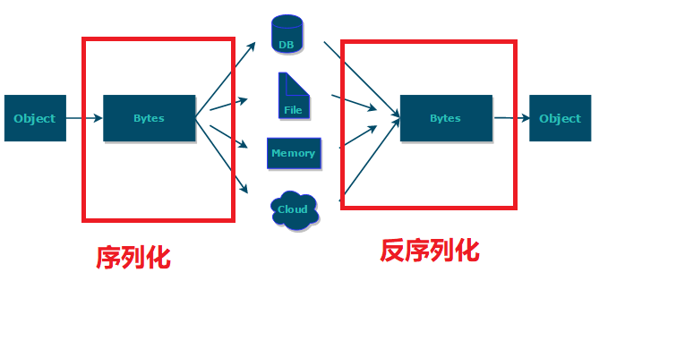
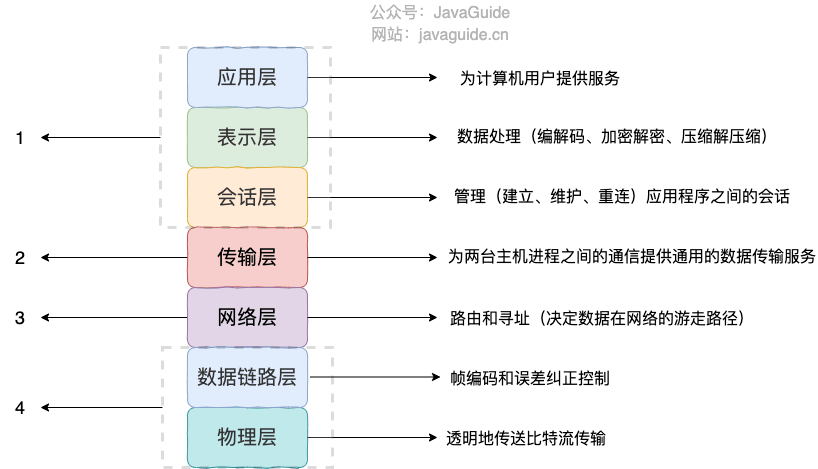

# 问题
1. 什么是序列化和反序列化?


---

Java对象保存在文件中/网络传输Java对象，这些场景需要用到序列化。


- 序列化：将Java对象或数据结构转化成二进制流
- 反序列化：将二进制流转化成Java对象或数据结构


# 使用场景
1. 对象在网络传输的时候，远程RPC调用的时候，首先序列化，在反序列化
2. 对象存文件
3. 对象存到数据库/redis/内存等，总之存进去的时候先序列化，取出来反序列化

**序列化的主要目的是通过网络传输对象或者说是将对象存储到文件系统、数据库、内存中。**




# 序列化协议TCP/IP 4 层模型的哪一层？

4层如下
1. 应用层
2. 传输层
3. 网络层
4. 网络接口层

在网络的的传输方式：
我们平时的app，由1->4得到结果，然后由4->1返回结果，这是一个完整的结果




如图就在在应用层进行数据处理（具体到osi7层模型的表示层），进行序列化和反序列化


# 序列化协议

1. JDK 自带的序列化，只需实现 java.io.Serializable接口即可。
2. 二进制的序列化协议， Hessian、Kryo、Protobuf、ProtoStuff
3. 文本序列化： JSON 和 XML 这种属于文本类序列化方式。虽然可读性比较好，但是性能较差


- jdk方式
```java
@AllArgsConstructor
@NoArgsConstructor
@Getter
@Builder
@ToString
public class RpcRequest implements Serializable {
    private static final long serialVersionUID = 1905122041950251207L;
    private String requestId;
    private String interfaceName;
    private String methodName;
    private Object[] parameters;
    private Class<?>[] paramTypes;
    private RpcMessageTypeEnum rpcMessageTypeEnum;
}
```

**serialVersionUID作用**
序列化号版本控制，反序列化比对，如果不一致会抛出 InvalidClassException 异常。建议手动添加，不然编译器会添加默认值。

---

 **serialVersionUID 不是被 static 变量修饰了吗？为什么还会被“序列化”？**
从JVM的运行内存分析，static修饰的常量在方法区中（1.8后元空间），本身不会被序列化。static 修饰的变量是属于类的不属于对象，所以不会序列化。

---

**如果有些字段不想进行序列化怎么办？**

对于不想进行序列化的变量，可以使用 transient 关键字修饰。

----


