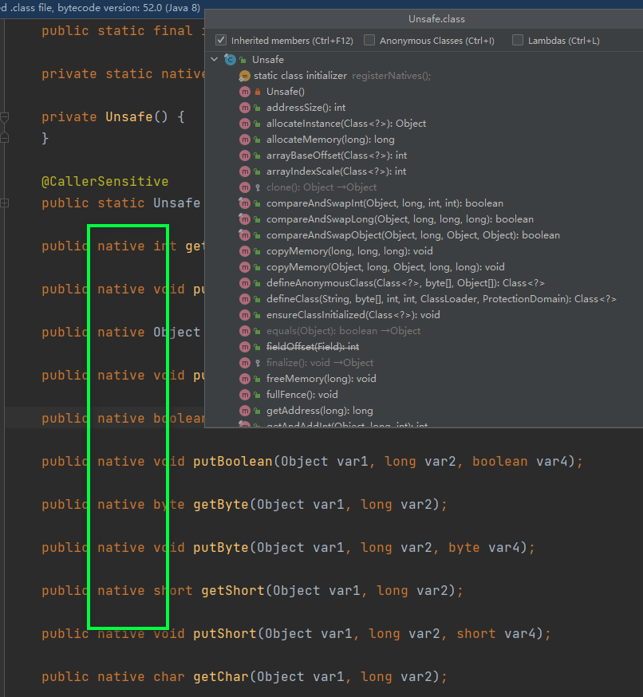
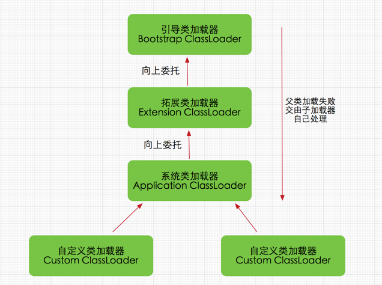

# 问题
1. Unsafe干嘛的
2. Unsafe什么时候用，使用场景
3. Unsafe用了会怎么样


# 介绍
Unsafe 是位于 sun.misc 包下的一个类，用于执行级别低，不安全的操作（不如直接访问系统内存资源，自主管理内存资源），提高Java的运行效率、增强Java语言底层资源的。**但是**Unsafe类有像C语言指针一样操作内存的能力，所以会有指针问题风险。所以使用需要谨慎。

Unsafe提供的方法依赖Native，具体实现是交给本地方法的（C/C++实现的）




>使用本地方法的原因
a.需要Java中不具备依赖于操作系统的特性，需要使用其他语言实现
b.程序对时间敏感程度非常高，需要使用靠近底层的语言，C/C++/汇编

--- 

# Unsafe创建
```java
// 方法
@CallerSensitive
    public static Unsafe getUnsafe() {
        Class var0 = Reflection.getCallerClass();
        // 仅在引导类加载器`BootstrapClassLoader`加载时才合法
        if (!VM.isSystemDomainLoader(var0.getClassLoader())) {
            throw new SecurityException("Unsafe");
        } else {
            return theUnsafe;
        }
    }
```
类加载器
BootstrapClassLoader（引导类加载器是加载Java中偏底层一点的东西）



>所以我们在平常是不能调用其中的方法的，包括上面的getUnsafe（）方法，因为我们自己写的会实在application中被加载的，所以调用的话会抛SecurityException安全异常。
这样被限制的原因是：
a.这是直接访问系统内存资源的安全隐患比较大。


# Unsafe的功能
1. 内存操作
2. 内存屏障
3. 对象操作
4. 数据操作
5. CAS 操作
6. 线程调度
7. Class 操作
8. 系统信息

## 1.内存操作
```java
//分配新的本地空间
public native long allocateMemory(long bytes);
//重新调整内存空间的大小
public native long reallocateMemory(long address, long bytes);
//将内存设置为指定值
public native void setMemory(Object o, long offset, long bytes, byte value);
//内存拷贝
public native void copyMemory(Object srcBase, long srcOffset,Object destBase, long destOffset,long bytes);
//清除内存
public native void freeMemory(long address);
```

- 测试内存操作的方法
```java

import sun.misc.Unsafe;

import java.lang.reflect.Field;

public class UnsafeTest {
    public static void main(String[] args) {
        memoryTest();
    }
    private static void memoryTest() {
        Unsafe unsafe = reflectGetUnsafe();
        int size = 4;
        long addr = unsafe.allocateMemory(size);
        long addr3 = unsafe.reallocateMemory(addr, size * 2);
        System.out.println("addr: "+addr);
        System.out.println("addr3: "+addr3);
        try {
            unsafe.setMemory(null,addr ,size,(byte)1);
            for (int i = 0; i < 2; i++) {
                unsafe.copyMemory(null,addr,null,addr3+size*i,4);
            }
            System.out.println(unsafe.getInt(addr));
            System.out.println(unsafe.getLong(addr3));
        }finally {
            unsafe.freeMemory(addr);
            unsafe.freeMemory(addr3);
        }
    }

    /**
     * 通过反射获取Unsafe类
     */
    private static Unsafe reflectGetUnsafe() {
        try {
            Field field = Unsafe.class.getDeclaredField("theUnsafe");
            field.setAccessible(true);
            return (Unsafe) field.get(null);
        } catch (Exception e) {
            return null;
        }
    }
}

```

## 2.内存屏障


<font color="red">后面深度学习，大佬https://github.com/Snailclimb/JavaGuide/blob/main/docs/java/basis/unsafe.md</font>