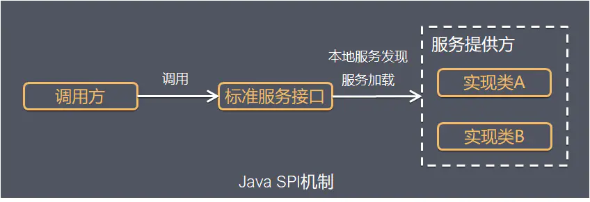
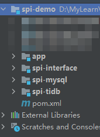
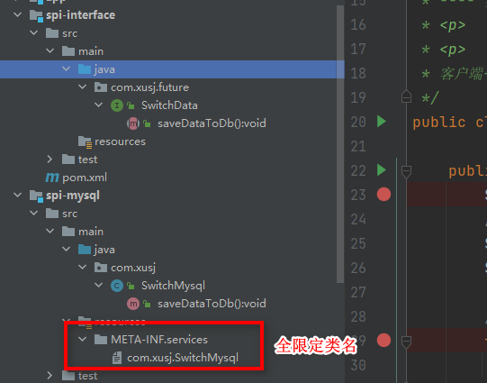

# 前言
SPI全称Service Provider Interface，是Java提供的一套用来被第三方实现或者扩展的API，它可以用来启用框架扩展和替换组件。
整体机制图如下：



Java SPI 实际上是<font color="red">“基于接口的编程＋策略模式＋配置文件”</font>组合实现的动态加载机制。

在面向的对象的设计里，一般推荐模块之间基于接口编程，模块之间不对实现类进行硬编码。一旦代码里涉及具体的实现类，就违反了可拔插的原则，如果需要替换一种实现，就需要修改代码。为了实现在模块装配的时候能不在程序里动态指明，这就需要一种服务发现机制。

Java SPI就是提供这样的一个机制：<font color="red">为某个接口寻找服务实现的机制</font>
。其核心思想：**解耦**


# 使用场景
概括地说，适用于：**调用者根据实际使用需要，启用、扩展、或者替换框架的实现策略**

比较常见的例子：

- 数据库驱动加载接口实现类的加载
JDBC加载不同类型数据库的驱动

- Spring MVC
Spring中大量使用了SPI,比如：对servlet3.0规范对ServletContainerInitializer的实现、自动类型转换Type Conversion SPI(Converter SPI、Formatter SPI)等
- Dubbo
Dubbo中也大量使用SPI的方式实现框架的扩展, 不过它对Java提供的原生SPI做了封装，允许用户扩展实现Filter接口

# SPI Demo Coding
1. 项目结构

>spi-interface 中定义接口；
spi-mysql 中去实现接口；
spi-tidb 实现接口；
app 通过策略去调用对应的实现类


2. 通过在 src/main/resources/ 下建立 /META-INF/services 目录，调用方完成对应的策略*这里可以风别调用两个服务中接口实现类*



3. 调用测试
```java
 public static void main(String[] args) {
        System.out.println("fghjk");
        //1、加载 可用的接口实现
        ServiceLoader<SwitchData> load = ServiceLoader.load(SwitchData.class);

        //拿到实现进行调用
        for (SwitchData service : load) {
            service.saveDataToDb();
        }
       

        
    }
```

1、 ServiceLoader：load（）指定一个接口，
 他就会加载当前系统里面所有的这个接口的【指定实现】
2、SPI（Service Provider Interface）
接口工程---提供接口
---- 实现工程1  ： 实现接口 【META-INF/services 创建文件  接口名作为文件名  实现类全路径作为文件内容】
---- 实现工程2  ： 实现接口
<p>
<p>
客户端----引用 工程1、或者 工程2