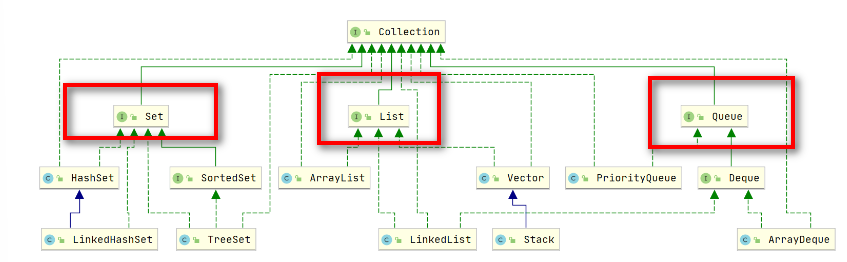

# 概述
1. Collection 单个元素

2. Map 键值对

> List, Set, Queue, Map 四者的区别？
1.List(对付顺序的好帮手): 存储的元素是**有序的、可重复的**。
2.Set(注重独一无二的性质): 存储的元素是**无序的、不可重复的。可以用于去重。（hashmap实现的底层）**
3.Queue(实现排队功能的叫号机): 按特定的排队规则来确定先后顺序，存储的元素是**有序的、可重复的。就是队列**
4.Map(用 key 来搜索的专家): 使用键值对（key-value）存储，类似于数学上的函数 y=f(x)，"x" 代表 key，"y" 代表 value，key 是无序的、不可重复的，value 是无序的、可重复的，每个键最多映射到一个值。

---

# 选用集合
### Map的选用
>Map主要是根据键值对存放，通过Key来获取value
- TreeMap 需要排序的时候选择
- HashMap 不需要排序的时候选择，我们平时用的最多
- ConcurrentHashMap 线程安全的情况使用，用法和HashMap一致

### Collection的选用
>只需要存放元素，List，Set最为常用
- ArrayList/LinkedList 有序可重复
- TreeSet/HashSet 无序不可重复

---

## Collection ---->List

### 1. ArrayList 和 Vector 的区别?
- ArrayList 是 List 的主要实现类，底层使用 Object[]存储，适用于频繁的查找工作，线程不安全 ；
- Vector 是 List 的古老实现类，底层使用Object[] 存储，线程安全的。(所有都加synchronized)
  
### 2. ArrayList 与 LinkedList 区别?
1. 使用最多ArrayList，底层数组。指定位置的删除和插入效率低，因为要移动。别的都快。（头尾操作也不慢的）

2. 基本不使用，连写LinkedList的作者都说写了LinkedList但是不用。性能不如ArrayList。除了删除快，别的都不行。

- **是否支持快速随机访问**： LinkedList 不支持高效的随机元素访问，而 ArrayList（实现了RandomAccess接口） 支持。快速随机访问就是通过元素的序号快速获取元素对象(对应于get(int index)方法)。
- **内存空间占用**： ArrayList 的空 间浪费主要体现在在 list 列表的结尾会预留一定的容量空间，而 LinkedList 的空间花费则体现在它的每一个元素都需要消耗比 ArrayList 更多的空间（***因为要存放直接后继和直接前驱以及数据***）。

## Collection ---> Set

>无序；去重

### 比较 HashSet、LinkedHashSet 和 TreeSet 三者的异同
- HashSet、LinkedHashSet 和 TreeSet 都是 Set 接口的实现类，都能保证元素唯一，并且都不是线程安全的。
- HashSet、LinkedHashSet 和 TreeSet 的主要区别在于底层数据结构不同。HashSet 的底层数据结构是哈希表（基于 HashMap 实现）。LinkedHashSet 的底层数据结构是链表和哈希表，元素的插入和取出顺序满足 FIFO。TreeSet 底层数据结构是红黑树，元素是有序的，排序的方式有自然排序和定制排序。
- 底层数据结构不同又导致这三者的应用场景不同。HashSet 用于不需要保证元素插入和取出顺序的场景，LinkedHashSet 用于保证元素的插入和取出顺序满足 FIFO 的场景，TreeSet 用于支持对元素自定义排序规则的场景。

