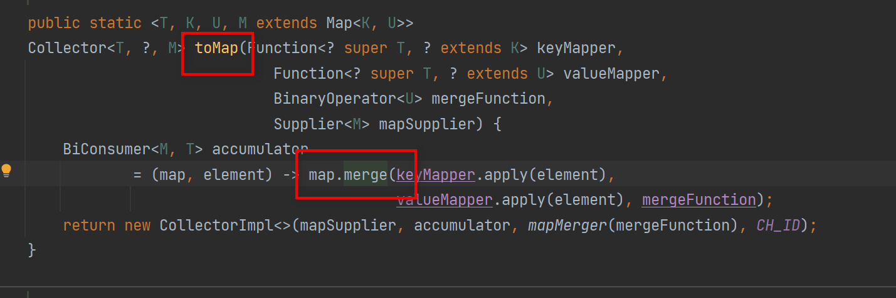
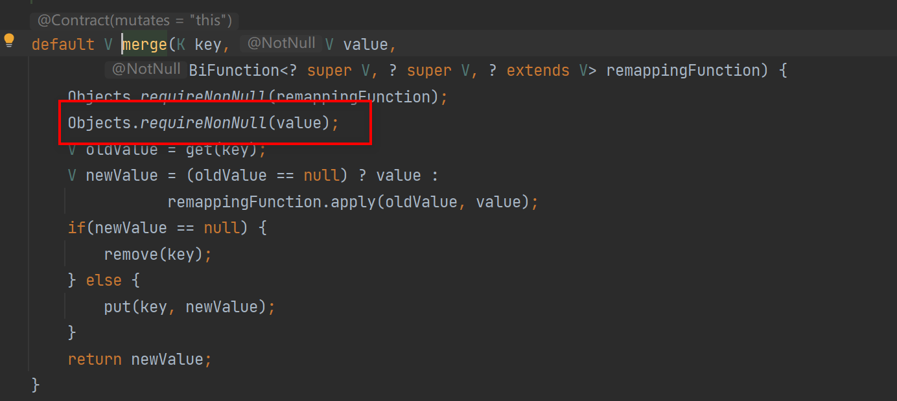

# 前置：问题
1. 判空
2. 集合转map
3. 集合遍历
4. 集合去重
5. 集合转数组
6. 数组转集合


# 一：集合判空
《阿里巴巴 Java 开发手册》的描述如下：

> 判断所有集合内部的元素是否为空，使用 isEmpty() 方法，而不是 size()==0 的方式。
> 我们在开发中也常用Spring提供的CollectionUtil.isEmpty(list)

```java
// ConcurrentHashMap 的 size() 方法和 isEmpty() 方法的源码。
public int size() {
    long n = sumCount();
    return ((n < 0L) ? 0 :
            (n > (long)Integer.MAX_VALUE) ? Integer.MAX_VALUE :
            (int)n);
}
final long sumCount() {
    CounterCell[] as = counterCells; CounterCell a;
    long sum = baseCount;
    if (as != null) {
        for (int i = 0; i < as.length; ++i) {
            if ((a = as[i]) != null)
                sum += a.value;
        }
    }
    return sum;
}
public boolean isEmpty() {
    return sumCount() <= 0L; // ignore transient negative values
}
```

Spring中的源码
```java
// 判null+判内容
public static boolean isEmpty(@Nullable Collection<?> collection) {
		return (collection == null || collection.isEmpty());
	}
```

Spring底层是直接使用isEmpty进行判空的。

这是因为 isEmpty() 方法的可读性更好，并且时间复杂度为 O(1)。

绝大部分我们使用的集合的 size() 方法的时间复杂度也是 O(1)，不过，也有很多复杂度不是 O(1) 的，比如 java.util.concurrent 包下的某些集合（ConcurrentLinkedQueue\ConcurrentHashMap...）<font color="red">出于时间复杂度的考虑</font>

---
# 二：集合转Map
《阿里巴巴 Java 开发手册》的描述如下：

>在使用 java.util.stream.Collectors 类的 toMap() 方法转为 Map 集合时，一定要注意当 value 为 null 时会抛 NPE 异常。

```java
class Dog {
    private String id;
    private String sex;
}

List<Dog> list = new ArrayList<>();
list.add(new Dog("1212121","公"));
// value为null值，会报npe
list.add(new Dog("435",null));
// 空指针异常
list.stream().collect(Collectors.toMap(Dog::getId, Dog::getSex));

```

异常原因



- value判空



# 集合遍历

《阿里巴巴 Java 开发手册》的描述如下：

> 不要在 foreach 循环里进行元素的 remove/add 操作(这个问题我踩过坑，和你想删的东西绝对不一样)。remove 元素请使用 Iterator 方式，如果并发操作，需要对 Iterator 对象加锁。

通过反编译你会发现 foreach 语法底层其实还是依赖 Iterator 。不过， remove/add 操作直接调用的是集合自己的方法，而不是 Iterator 的 remove/add方法

这就导致 Iterator 莫名其妙地发现自己有元素被 remove/add ，然后，它就会抛出一个 <font color="red">ConcurrentModificationException </font>来提示用户发生了并发修改异常。这就是单线程状态下产生的 fail-fast 机制。

Java8之后使用removeIf

```java
List<Integer> list = new ArrayList<>();
for (int i = 1; i <= 10; ++i) {
    list.add(i);
}
// 这个蛮好用的
list.removeIf(filter -> filter % 2 == 0); /* 删除list中的所有偶数 */
System.out.println(list); /* [1, 3, 5, 7, 9] */
```


---


# 集合去重
《阿里巴巴 Java 开发手册》的描述如下：

> 可以利用 Set 元素唯一的特性，可以快速对一个集合进行去重操作，避免使用 List 的 contains() 进行遍历去重或者判断包含操作。

```java
// Set 去重代码示例

// 无hash冲突时时间复杂度O（1）
public static <T> Set<T> removeDuplicateBySet(List<T> data) {

    if (CollectionUtils.isEmpty(data)) {
        return new HashSet<>();
    }
    return new HashSet<>(data);
}

// List 去重代码示例

//时间复杂度O（n） ，跟进去看contains方法就可以看出来
public static <T> List<T> removeDuplicateByList(List<T> data) {

    if (CollectionUtils.isEmpty(data)) {
        return new ArrayList<>();

    }
    List<T> result = new ArrayList<>(data.size());
    for (T current : data) {
        if (!result.contains(current)) {
            result.add(current);
        }
    }
    return result;
}


// testMy

 List<Integer> integers = Arrays.asList(1, 1, 1, 12, 32, 32, 3245, 3123, 6, 6);
        // 推荐去重方式
        HashSet<Integer> integers1 = new HashSet<>(integers);
        System.out.println(JSON.toJSONString(integers1));
```
---

# 集合转数组
《阿里巴巴 Java 开发手册》的描述如下：

> 使用集合转数组的方法，必须使用集合的 toArray(T[] array)，传入的是类型完全一致、长度为 0 的空数组。

toArray(T[] array) 方法的参数是一个泛型数组，如果 toArray 方法中没有传递任何参数的话返回的是 Object类 型数组。

```java
String [] s= new String[]{
    "dog", "lazy", "a", "over", "jumps", "fox", "brown", "quick", "A"
};
List<String> list = Arrays.asList(s);
Collections.reverse(list);
//没有指定类型的话会报错
s=list.toArray(new String[0]);

```
由于 JVM 优化，<font color="red">new String[0]</font>作为<font color="red">Collection.toArray()方法</font>的参数现在使用更好，new String[0]就是起一个模板的作用，指定了返回数组的类型，0 是为了节省空间，因为它只是为了说明返回的类型。详见：https://shipilev.net/blog/2016/arrays-wisdom-ancients/


----


# 数组转集合
《阿里巴巴 Java 开发手册》的描述如下：

> 使用工具类 Arrays.asList() 把数组转换成集合时，不能使用其修改集合相关的方法， 它的 add/remove/clear 方法会抛出 UnsupportedOperationException 异常。

Arrays.asList()在平时开发中还是比较常见的，我们可以使用它将一个数组转换为一个 List 集合。

```java
String[] myArray = {"Apple", "Banana", "Orange"};
List<String> myList = Arrays.asList(myArray);
//上面两个语句等价于下面一条语句
List<String> myList = Arrays.asList("Apple","Banana", "Orange");

```
JDK源码
```java
/**
  *返回由指定数组支持的固定大小的列表。此方法作为基于数组和基于集合的API之间的桥梁，
  * 与 Collection.toArray()结合使用。返回的List是可序列化并实现RandomAccess接口。
  */
public static <T> List<T> asList(T... a) {
    return new ArrayList<>(a);
}
```
