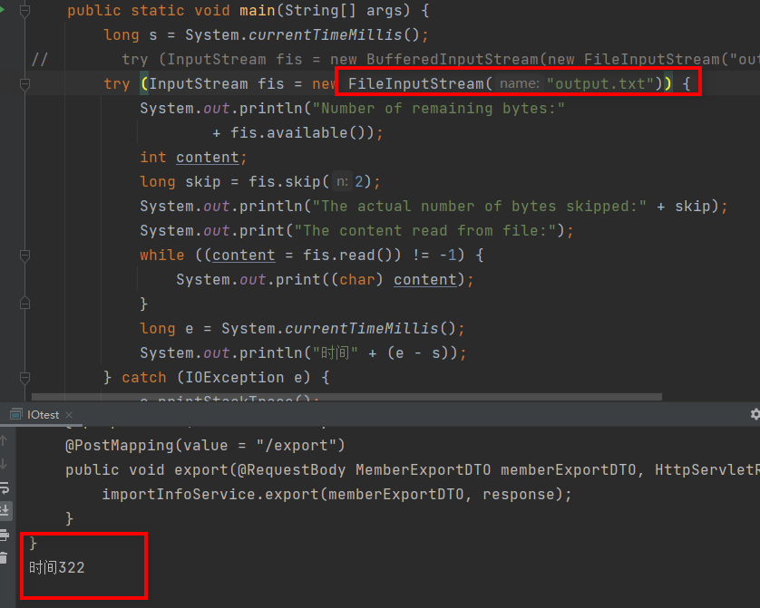
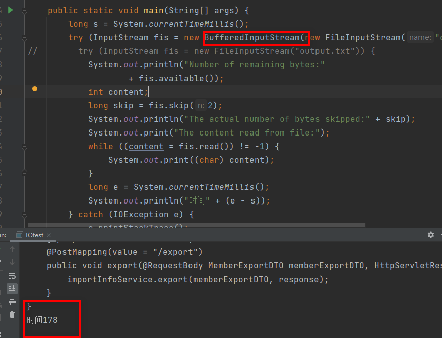

# 简介
IO流，以计算机内存为主体，从内存到网络/磁盘等其他地方叫输出流(内存往外出)；网络/磁盘等其他地方写到内存叫输入流（往内存输入）。


Java中的IO流 4个抽象基类
- InputStream/Reader(读到内存里)
  - 所有的输入流的基类，前者是字节输入流，后者是字符输入流。
- OutputStream/Writer（由内存往外写）
  - 所有输出流的基类，前者是字节输出流，后者是字符输出流。


---

# 字节流

## InputStream（字节输入流）
> InputStream用于从源头（通常是文件）读取数据（字节信息）到内存中，java.io.InputStream抽象类是所有字节输入流的父类。业务场景：将文件里面的内容读到内存中要干事情


```java
public static void main(String[] args) {
    // 读取对应的文件，把output.txt这个文件，通过InputStream输入流读取到内存中，读取文件的输入流FileInputStream
        try (InputStream fis = new FileInputStream("output.txt")) {
            System.out.println("Number of remaining bytes:"
                    + fis.available());
            int content;
            long skip = fis.skip(2);
            System.out.println("The actual number of bytes skipped:" + skip);
            System.out.print("The content read from file:");
            while ((content = fis.read()) != -1) {
                System.out.print((char) content);
            }
        } catch (IOException e) {
            e.printStackTrace();
        }
    }
```

**注意**：
一般我们是不会直接单独使用 FileInputStream ，通常会配合 <font color="red">BufferedInputStream</font>（字节缓冲输入流，后文会讲到）来使用。


**字节缓冲流作用指的是**：相当于中间加一道缓存，然后在将字节流读到缓存中，当缓存中到一定的量的时候将缓冲中的字节一次倒倒内存中提高效率。
IO 操作是很消耗性能的，缓冲流将数据加载至缓冲区，一次性读取/写入多个字节，从而避免频繁的 IO 操作，提高流的传输效率。减少IO的次数提高效率

```java
 public static void main(String[] args) {
        long s = System.currentTimeMillis();
        try (InputStream fis = new BufferedInputStream(new FileInputStream("output.txt"))) {
//        try (InputStream fis = new FileInputStream("output.txt")) {
            System.out.println("Number of remaining bytes:"
                    + fis.available());
            int content;
            long skip = fis.skip(2);
            System.out.println("The actual number of bytes skipped:" + skip);
            System.out.print("The content read from file:");
            while ((content = fis.read()) != -1) {
                System.out.print((char) content);
            }
            long e = System.currentTimeMillis();
            System.out.println("时间" + (e - s));
        } catch (IOException e) {
            e.printStackTrace();
        }
    }
```


#### 使用字节缓存流的效率比较 解释上面的字节缓冲流的作用
- 普通文件输入流 3000行文件，322ms

- 使用字符缓存流   178ms 快了3倍左右



## OutputStream（字节输出流）
> 将数据通过内存写到别的地方，比如将文件写到本地。OutputStream是所有输出流的父类


和输出流基本上是一样的，唯一的区别就是，将数据转化为字节，然后调用write写到指定的地方。
```java
  public static void main(String[] args) {
        long s = System.currentTimeMillis();
        try (FileOutputStream output = new FileOutputStream("输出流.txt")) {
            // 和输入流唯一的区别
            byte[] array = ("daf").getBytes();
            output.write(array);
            long e = System.currentTimeMillis();
            System.out.println("时间" + (e - s));
        } catch (IOException e) {
            e.printStackTrace();
        }
    }
```

**注意**：
输出流也是有字节缓冲流的BufferedOutputStream。和上面的输入流是一样的作用这里不多做解释。


# 字符流
- 不管是文件读写还是网络发送接收，**信息的最小存储单元都是字节**。 那为什么 I/O 流操作要分为字节流操作和字符流操作呢？
  - 1.字符流是由 Java 虚拟机将字节转换得到的，这个过程还算是比较耗时。
  - 2.如果我们不知道编码类型就很容易出现乱码问题。

问题：当文件中是中文的时候，我们读到的就是乱码


# Reader（字符输入流）
- 桥接模式

```java
// 字节流转换为字符流的桥梁
public class InputStreamReader extends Reader {
}
// 用于读取字符文件
public class FileReader extends InputStreamReader {
}

```

```java
// 中文读出来就不是乱码了
try (FileReader fileReader = new FileReader("input.txt");) {
    int content;
    long skip = fileReader.skip(3);
    System.out.println("The actual number of bytes skipped:" + skip);
    System.out.print("The content read from file:");
    while ((content = fileReader.read()) != -1) {
        System.out.print((char) content);
    }
} catch (IOException e) {
    e.printStackTrace();
}
```

# Writer（字符输出流）

- 同上
```java
try (Writer output = new FileWriter("output.txt")) {
    output.write("你好，我是Guide。");
} catch (IOException e) {
    e.printStackTrace();
}
```


# 字符缓冲流
BufferedReader （字符缓冲输入流）和 BufferedWriter（字符缓冲输出流）类似于 BufferedInputStream（字节缓冲输入流）和BufferedOutputStream（字节缓冲输入流），内部都维护了一个字节数组作为缓冲区。不过，前者主要是用来操作字符信息。
