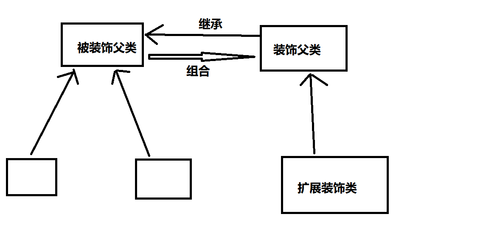

# IO中的设计模式

> 通过IO流中的经典设计模式，加强对对应设计模式和IO流的理解

# 一：IO中的装饰者模式

> 装饰者模式在不改变原来类的基础上，可以对类进行扩展其功能
>装饰者模式是用过组合的方式来来扩展类的功能
>使用场景：
> 1.继承关系比较复杂的场景（IO流就是这样一个继承关系复杂的场景）

## 简述装饰者模式

参考文献：https://www.runoob.com/design-pattern/decorator-pattern.html

## IO流中的装饰者模式简述
通过 BufferedInputStream（字节缓冲输入流）来增强 FileInputStream 的功能、

对应上图：
1. BufferedInputStream就是装饰类
2. FileInputStream被装饰类
3. FileInputStream它的顶层被装饰父类就是InputStream

看了源码可以知道，其实它的结构并不是刻板的使用，而是用了其中的思想。

