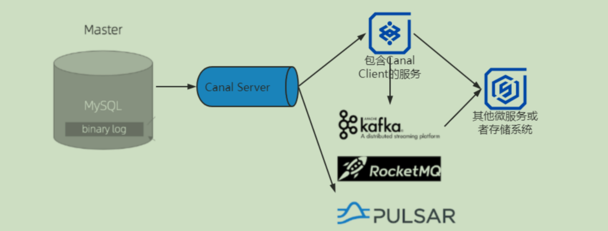
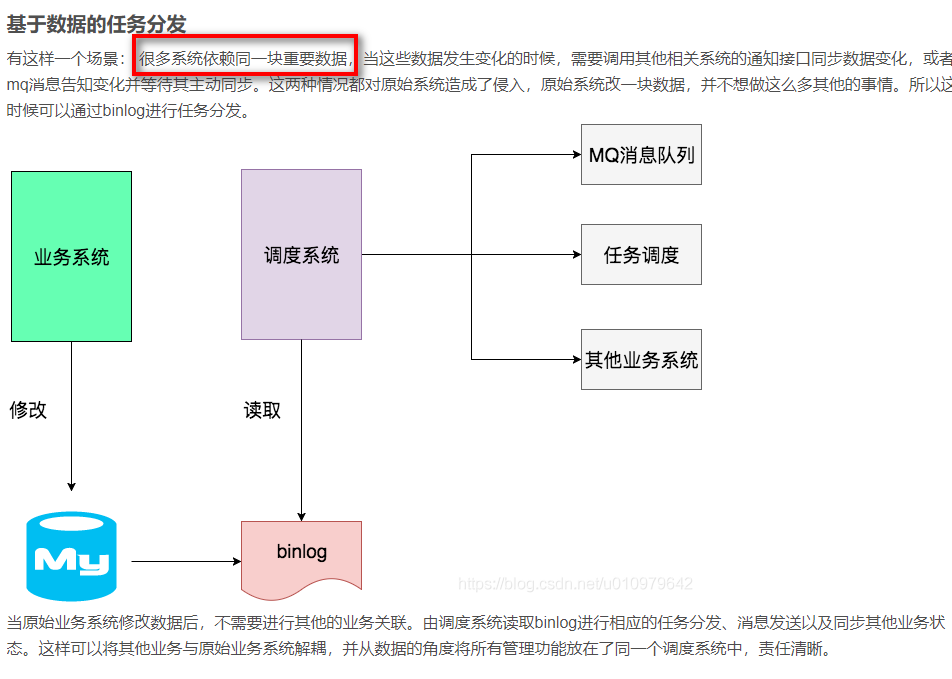
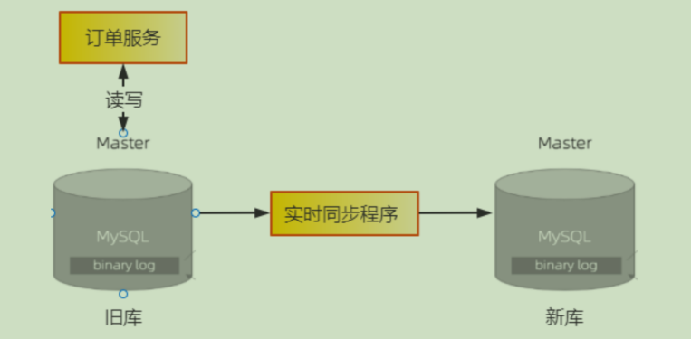
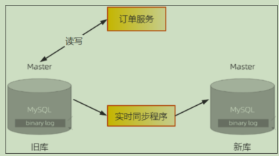
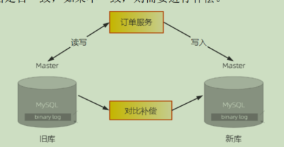
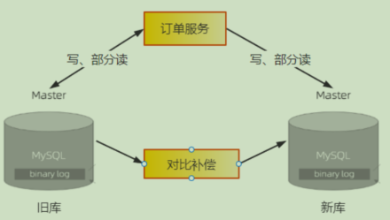
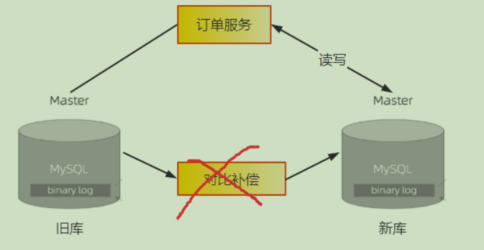

# 前言

一. 解决缓存不命中（高并发操作击穿打挂DB的风险）
   1. 当并发量打的时候，当我们的缓存过期时，就算到数据库的比例偏小的时候，我们的请求时比较大的。那也会存在数据库崩掉的情况。
   2. 解决方案想法如下（总体思想就是**全放到redis中**，但是DB要更新的时候，Redis也需要更新，那就存在缓存击穿的情况，对于这个情况有以下的思路）：
      1. 加锁（首先加锁只能对同一个查询对象对于多的查询是不可选的，并且加锁对我们的效率大打折扣，我们在系统中非必要的情况都是在进行**无锁化编程**）
      2.**缓存预热**，当系统启动时将缓存进行预热。
      3. 对于使用缓存我们还是需要考虑数据一致性的问题，面对这个问题我们很容易想到设置缓存的过期时间，但是对于高并发的场景我们就最好不要设置缓存过期，因为对于高并发的时候我们还是存在击穿的情况，造成数据库挂掉。对于此种情况我们最好**设置永不过期**。
      4. 对于**永不过期**的情况，我们最好设置的设计就是使用**MQ来保证数据的一致性**。，然后注意解决消息的可靠性问题即可，这种方式实现起来很简单，也没有什么侵入性。
---
二. 如何使用Binlog实时更新Redis缓存(当没部署Mq时)
   1. BinLog是MySql的操作日志
   2. 还有一个是事务日志redoLog和undoLog
   3. 对于着两种日志mySql为了保证双写一致，使用的是**2pc（双阶段提交）**
---
三. Canal详解与实战
   1. 阿里开源的监听解析mySql的操作日志的开源框架
---
四. 基于Binlog实现跨系统实时数据同步

---
五. 如何实现不停机更换数据库
   1. 一步一步进行改造
   2. 了解热开关对系统改造的重要性
   3. 都要**兜底方案**，就是可以返回**上一个版本**（所有的系统设计都需要重要）
---
六. 如何更安全地实现数据备份和恢复

# BinLog的使用
整体的使用链路

- 建议再开一个专门的服务来监听BinLog，让一些东西，保持在我们自己可控的范围。

binlog是mysql提供的数据同步机制，很好的解决了主从分离、读写库分离等业务。而我们可以构建一个中间件系统，“伪造”成master的一个slave。当读取了binlog中的数据变化后，根据相应的业务场景做各种业务处理。而目前我接触到的最常见的就是第一个场景——**数据异构（数据一致）**，可以异构到其他表中，也可以异构到其他数据引擎中，比如Elastic Search/redis。

来自网络

>binlog可能中使用Canal需要对DB的binLog特别了解，所以使用MQ来同步更为容易，可读性更高

# 使用Mq来保证数据的一致性
这个方案就比较简单了，也是最常使用的。但是引入中间件增加了系统数据的链路和系统的复杂度。

# 数据库迁移（或者表对表的数据迁移都和这个差不多）

## 实现不停机更换数据库
所以我们在设计迁移方案的时候，一定要保证每一步都是可逆的。也就是必须保证，每执行完一个步骤,一旦出现任何问题，都能快速回滚到上一个步骤。这是设计这种升级类技术方案的时候比较容易忽略的问题。

1. 将旧数据全量同步到新库中，但是这时数据还会写到旧库中。我们不仅要向新库复制数据，还要保证新旧两个库的数据是实时同步的。所以，需要用一个同步程序来实现新旧两个数据库的实时同步。(可以加一个热控制开关全局控制)
   

- 方案：
  - 1.使用mq （推荐简单coding，需要部署mq）
  - 2.使用binlog

---
2. 然后需要改造一下订单服务，业务逻辑部分不需要变动，数据访问的 DAO
层需要进行如下改造：
1）支持双写新旧两个库，并且预留**热切换开关**，能通过开关控制三种写状态:只写旧库、只写新库和同步双写。
2）支持读取新旧两个库，同样预留**热切换开关**，控制读取旧库还是新库。

3)然后上线新版的订单服务，这个时候订单服务仍然是只读写旧库，不读写新库。让这个新版的订单服务稳定运行至少一到两周的时间，其间我们不仅要验证新版订单服务的稳定性，还要验证新旧两个订单库中的数据是否保持一致。这个过程中，如果新版订单服务出现任何问题，都要立即下线新版订单服务，回滚到旧版本的订单服务。

---

3、稳定一段时间之后，就可以开启订单服务的双写开关了。开启双写开关的同时，需要停掉同步程序。这里有一个需要特别注意的问题是，这里双写的业务逻辑，一定是先写旧库，再写新库，并且以旧库的结果为准。
如果旧库写成功，新库写失败，则返回成功，但这个时候要记录日志，后续我们会根据这个日志来验证新库是否还有问题。如果旧库写失败，则直接返回失败，同时也不再写新库了。这么做的原因是不能让新库影响到现有业务的可用性和数据准确性。上面这个过程如果出现任何问题都要关闭双写,回滚到只读写旧库的状态。
切换到双写之后,新库与旧库的数据可能会出现不一致的问题。原因有两点：
一是停止同步程序和开启双写，这两个过程很难做到无缝衔接；
二是双写的第略也不能保证新旧库的强一致性。对于这个问题,我们需要上线一个比对和补偿的程序，用于比对旧库最近的数据变更，然后检查新库中的数据是否一致，如果不一致，则需要进行补偿。

开启双写之后，还需要稳定运行至少几周的时间，并且在这期间我们需要不断地检查，以确保不能有旧库写成功、新库写失败的问题。如果在几周之后比对程序发现新旧两个库的数据没有不一致的情况，那就可以认为新旧两个库的数据一直都是保持同步的。

---

4、接下来就可以用类似灰度发布的方式把读请求逐步切换到新库上。同样，运行期间如果出现任何问题，都要再切回到旧库。

---

5、将全部读请求都切换到新库上之后，其实读写请求已经全部切换到新库上了，虽然实际的切换已经完成,但后续还有需要收尾的步骤。再稳定一段时间之后，就可以停掉比对程序，把订单服务的写状态改为只写新库。至此，旧库就可以下线了。注意，在整个迁移过程中,只有这个步骤是不可逆的。由于这一步的主要操作就是摘掉已经不再使用的旧库，因此对于正在使用的新库并不会有什么影响，实际出问题的可能性已经非常小了。

- 总结数据迁移这种
  - 1.一步一步的进行迁移，切勿一口吃成一个胖子
  - 2.对热切换开关的使用特别重要
  - 3.必须保证每轮都要返回回滚到上一个版本，不能影响系统的总体数据
  - 4.补偿机制特别重要，一定要做好备份
  - 特别感谢mark老师的教导和慷慨解囊

