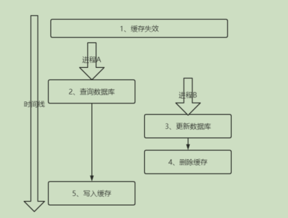
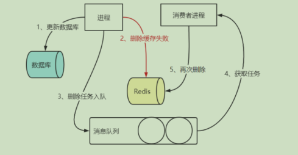
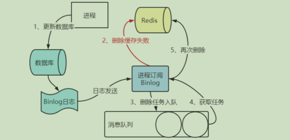
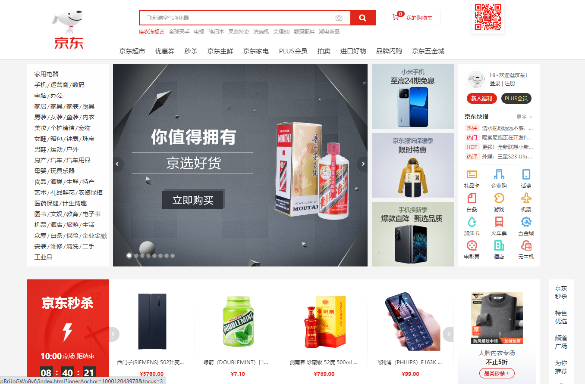
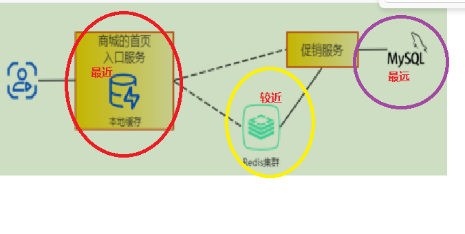

# 前言

对于我们日常开发的应用系统。由于MySQL等关系型数据库读写的并发量是有一定的上线的，当请求量过大时候那数据库的压力一定会上来。

所以采用 MySQL+Redis 这对经典组合来解决高并发问题的。Redis 作为 MySQL 的前置缓存，可以应对绝大部分查询请求，从而在很大程度上缓解 MySQL 并发请求的压力，但是不能一说到缓存脑海中就只有 Redis，这无论在工作还是面试中都不合适，所以我们先全面了解缓存。

**注意：缓存不止有redis，需要全面的了解缓存**

---

# 概述
- 缓存大体可以分为三类(意思就是在整个系统中我们每一层都是有缓存的):
  - 客户端缓存；
  - 服务端缓存；
  - 网络中的缓存。
- 根据规模和部署方式缓存也可以分为:
    - 单体缓存；
    - 缓存集群；
    - 分布式缓存。

我们通过对每一层进行缓存来提高系统的稳定性和效率。


---
# 实践


## 一、缓存数据一致
>不论是本地缓存还是redis，我们的基本思路就是：当缓存没有命中的时候，我们就去数据库查询，然后直接放到缓存中，供下次查询以加快查询效率。
但是我们在修改数据的时候，就可能造成数据库和缓存数据一致性的问题。
有好几种解决方案，（两大类：一：更新；二：删除）1. 先更新缓存，再更新数据库2. 先更新数据库，再更新缓存3、先删除缓存，后更新数据库4、先更新数据库，后删除缓存

### 1.更新缓存类
不论先更新数据库还是先更新缓存，这两种方案都不可取。原因就是不论我们先更新谁后更新谁，就会导致我们前面更新成功后，后面更新的那个万一挂了，我们就难以判断是否成功。所以这类更新的方案，对我们来说都是不可取的。

### 2.删除缓存类
- 2.1 先删缓存，后更新数据库
    - 问题：
      - 线程A删除缓存后，更新DB，但是DB的事务并没有提交，线程B进来访问。那么就会重新更新缓存（造成缓存和DB数据不一致）
  

  - 解决方案
    - 使用延时双删
      - 1.先删除缓存，再去更新DB
      - 2.当DB更新成功之后，延时个1s，再删除一次缓存
---
- 2.2 先更新数据库，后删除缓存（开发中常用的策略）
  - 问题：
    - 在缓存失效的且并发的时候会发生（虽然概率比较小但是还是会发生，因为概率小所以我们在开发中常用）
  
  - 解决方案：
    - 1.设置缓存失效时间。
    - 2.<font color="red">**异步延时删除机制**(问题在于当我们删除缓存的时候万一失败需要补偿机制来保证缓存一定删除)</font>
异步补偿删除方案一：
  


  异步补偿删除方案二：
  >由于方案一中的业务代码的耦合性较高。使用订阅数据库的binlog

  

  说到底就是通过数据库的 binlog 来异步淘汰 key，利用工具(canal)将 binlog
日志采集发送到 MQ 中，然后通过 ACK 机制确认处理删除缓存。
先更新 DB，后删除缓存，这种方式，被称为 Cache Aside Pattern，属于缓存更新的设计模式之一。（这是一种最为标准的方案）


----

## 二、项目实践（商城项目）
**我这边以京东商城为例**



像这样的商城首页一定是并发最高的地方，如果我们每次都去数据库查询，很显然是不满足我们高并发的要求的。

像这种任何用户看到的都是一样的结果的数据，在缓存中的命中率是比较高得，所以我们可以考虑引入缓存的方式。
并且我们这里完全可以分为多个key，如促销，轮播图，标签等。

1. 首页缓存使用
```java
// 大佬的代码例子
 public HomeContentResult getFromRemote(){
        List<PmsBrand> recommendBrandList = null;
        List<SmsHomeAdvertise> smsHomeAdvertises = null;
        List<PmsProduct> newProducts  = null;
        List<PmsProduct> recommendProducts  = null;
        HomeContentResult result;
        /*从redis获取*/
        if(promotionRedisKey.isAllowRemoteCache()){
            recommendBrandList = redisOpsUtil.getListAll(promotionRedisKey.getBrandKey(), PmsBrand.class);
            smsHomeAdvertises = redisOpsUtil.getListAll(promotionRedisKey.getHomeAdvertiseKey(), SmsHomeAdvertise.class);
            newProducts = redisOpsUtil.getListAll(promotionRedisKey.getNewProductKey(), PmsProduct.class);
            recommendProducts = redisOpsUtil.getListAll(promotionRedisKey.getRecProductKey(), PmsProduct.class);
        }
        /*redis没有则从微服务中获取*/
        if(CollectionUtil.isEmpty(recommendBrandList)
                ||CollectionUtil.isEmpty(smsHomeAdvertises)
                ||CollectionUtil.isEmpty(newProducts)
                ||CollectionUtil.isEmpty(recommendProducts)) {
            result = promotionFeignApi.content(0).getData();
        }else{
            result = new HomeContentResult();
            result.setBrandList(recommendBrandList);
            result.setAdvertiseList(smsHomeAdvertises);
            result.setHotProductList(recommendProducts);
            result.setNewProductList(newProducts);
        }
        return result;
    }
```
---

redis 初始化key代码<font color="red">初始化注解@PostConstruct</font>
```java
@Service
@Slf4j
public class PromotionRedisKey {
    // 配置
    @Value ("${namespace.promotion:prmtd}")
    private String promotionNamespace;

    @Value ("${promotion.brand:br}")
    private String brand;

    @Value ("${promotion.newProduct:np}")
    private String newProduct;

    @Value ("${promotion.recProduct:rp}")
    private String recProduct;

    @Value ("${promotion.homeAdvertise:hd}")
    private String homeAdvertise;

    @Value ("${promotion.seckill:sk}")
    private String secKill;
    // 需要初始化的key
    private String brandKey;
    private String newProductKey;
    private String recProductKey;
    private String homeAdvertiseKey;
    private String secKillKey;

    // 全局缓存控制开关
     @Value("${promotion.demo.allowLocalCache:true}")
    private boolean allowLocalCache;

    @Value("${promotion.demo.allowRemoteCache:true}")
    private boolean allowRemoteCache;


    /**
     * 该注解的方法在整个Bean初始化中的执行顺序：
     *
     * Constructor(构造方法) -> @Autowired(依赖注入) -> @PostConstruct(注释的初始化方法)
     *
     * 该注解的功能：当依赖注入完成后用于执行初始化的方法，并且只会被执行一次
     */
    @PostConstruct
    public void initKey(){
        brandKey = promotionNamespace + "." + brand;
        newProductKey = promotionNamespace + "." + newProduct;
        recProductKey = promotionNamespace + "." + recProduct;
        homeAdvertiseKey = promotionNamespace + "." + homeAdvertise;
        secKillKey = promotionNamespace + "." + secKill;
        StringBuilder logKeyStr = new StringBuilder();
        logKeyStr.append("[品牌推荐redis主键=").append(brandKey)
                .append("] [新品推荐redis主键=").append(newProductKey)
                .append("] [人气推荐redis主键=").append(recProductKey)
                .append("] [轮播广告redis主键=").append(homeAdvertiseKey)
                .append("] [秒杀redis主键=").append(secKillKey)
                .append("]");
        log.info("促销系统Redis主键配置：{}",logKeyStr);
    }

    public String getBrandKey() {
        return brandKey;
    }

    public String getNewProductKey() {
        return newProductKey;
    }

    public String getRecProductKey() {
        return recProductKey;
    }

    public String getHomeAdvertiseKey() {
        return homeAdvertiseKey;
    }

    public String getSecKillKey() {
        return secKillKey;
    }

   

    public boolean isAllowLocalCache() {
        return allowLocalCache;
    }

    public boolean isAllowRemoteCache() {
        return allowRemoteCache;
    }
}


```


---
通过以上首页对缓存的使用，提出一些思考如下：
缓存一定是**离用户越近越好**，依据这个原则，首页还有优
化的空间，从上面的访问路径可以看到，首页服务需要到 Redis 集群中获得数据用以展示，能不能将缓存的数据再提前呢？于是我们在首页服务内引入了应用级缓存 Caffeine。


什么叫近？？？



  
>**TIPS**：Caffeine 基于 Google 的 Guava Cache，提供一个性能卓越的本地缓存(local cache) 实现, 也是 SpringBoot 内置的本地缓存实现，有资料表明 Caffeine性能是 Guava Cache 的 6 倍


Caffeine使用
```java
@Configuration
public class CaffeineCacheConfig {

    @Bean(name = "promotion")// 缓存预热(指定bean名称)
    public Cache<String, HomeContentResult> promotionCache() {
        int rnd = ThreadLocalRandom.current().nextInt(10);
        return Caffeine.newBuilder()
                // 设置最后一次写入经过固定时间过期
                .expireAfterWrite(30 + rnd, TimeUnit.MINUTES)
                // 初始的缓存空间大小
                .initialCapacity(20)
                // 缓存的最大条数
                .maximumSize(100)
                .build();
    }

    /*以双缓存的形式提升首页的访问性能，这个备份缓存其实设置为永不过期更好，
    * 可以作为首页的降级和兜底方案
    * 为了说明缓存击穿和分布式锁这里设置了一个过期时间*/
    @Bean(name = "promotionBak")
    public Cache<String, HomeContentResult> promotionCacheBak() {
        int rnd = ThreadLocalRandom.current().nextInt(10);
        return Caffeine.newBuilder()
                // 设置最后一次访问经过固定时间过期
                .expireAfterAccess(41 + rnd, TimeUnit.MINUTES)
                // 初始的缓存空间大小
                .initialCapacity(20)
                // 缓存的最大条数
                .maximumSize(100)
                .build();
    }

    /*秒杀信息在首页的缓存*/
    @Bean(name = "secKill")
    public Cache<String, List<FlashPromotionProduct>> secKillCache() {
        int rnd = ThreadLocalRandom.current().nextInt(400);
        return Caffeine.newBuilder()
                // 设置最后一次写入经过固定时间过期
                .expireAfterWrite(500 + rnd, TimeUnit.MILLISECONDS)
                // 初始的缓存空间大小
                .initialCapacity(20)
                // 缓存的最大条数
                .maximumSize(100)
                .build();
    }

    /*秒杀信息在首页的缓存备份，提升首页的访问性能*/
    @Bean(name = "secKillBak")
    public Cache<String, List<FlashPromotionProduct>> secKillCacheBak() {
        int rnd = ThreadLocalRandom.current().nextInt(400);
        return Caffeine.newBuilder()
                // 设置最后一次写入经过固定时间过期
                .expireAfterWrite(100 + rnd, TimeUnit.MILLISECONDS)
                // 初始的缓存空间大小
                .initialCapacity(20)
                // 缓存的最大条数
                .maximumSize(100)
                .build();
    }
}


```


```java

    @Autowired
    @Qualifier("promotion") // 指定注入相关对象和上面的配置一致，就是在容器中拿对应的值
    private Cache<String, HomeContentResult> promotionCache;

   
    @Override
    public HomeContentResult cmsContent(HomeContentResult content) {
        //获取推荐专题
        content.setSubjectList(homeDao.getRecommendSubjectList(0,4));
        return content;
    }

    /*处理首页推荐品牌和商品内容*/
    @Override
    public HomeContentResult recommendContent(){
        /*品牌和产品在本地缓存中统一处理，有则视为同有，无则视为同无*/
        final String brandKey = promotionRedisKey.getBrandKey();
        final boolean allowLocalCache = promotionRedisKey.isAllowLocalCache();
        /*先从本地缓存中获取推荐内容*/
        HomeContentResult result = allowLocalCache ?
                promotionCache.getIfPresent(brandKey) : null;
        if(result == null){
            result = allowLocalCache ?
                    promotionCacheBak.getIfPresent(brandKey) : null;
        }
        /*本地缓存中没有*/
        if(result == null){
            log.warn("从本地缓存中获取推荐品牌和商品失败，可能出错或禁用了本地缓存[allowLocalCache = {}]",allowLocalCache);
            // 去redis中去，没有再去DB中取
            result = getFromRemote();
            if(null != result) {
                promotionCache.put(brandKey,result);
                promotionCacheBak.put(brandKey,result);
            }
        }
        /* 处理秒杀内容*/
        final String secKillKey = promotionRedisKey.getSecKillKey();
        List<FlashPromotionProduct> secKills = secKillCache.getIfPresent(secKillKey);
        if(CollectionUtils.isEmpty(secKills)){
            secKills = secKillCacheBak.getIfPresent(secKillKey);
        }
        if(CollectionUtils.isEmpty(secKills)){
            /*极小的概率出现本地两个缓存同时失效的问题，
            从远程获取时，只从Redis缓存中获取，不从营销微服务中获取，
            避免秒杀的流量冲垮营销微服务*/
            secKills = getSecKillFromRemote();
            if(!CollectionUtils.isEmpty(secKills)) {
                secKillCache.put(secKillKey,secKills);
                secKillCacheBak.put(secKillKey,secKills);
            }else{
                /*Redis缓存中也没有秒杀活动信息，此处用一个空List代替，
                * 其实可以用固定的图片或信息，作为降级和兜底方案*/
                secKills = new ArrayList<FlashPromotionProduct>();
            }
        }
        result.setHomeFlashPromotion(secKills);
        // fixme CMS本次不予实现，设置空集合
        result.setSubjectList(new ArrayList<CmsSubject>());
        return result;
    }

```