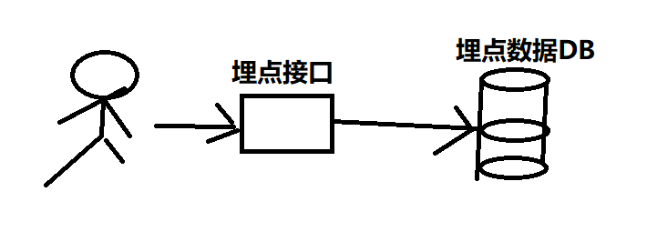
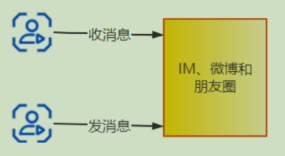
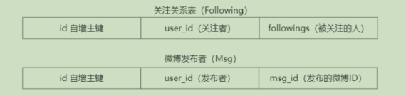
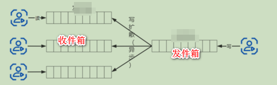

# 高并发下的读/写
> 在系统中不仅仅只有读，也不会只有写，那我们就需要考虑，当前需求是并发读还是并发写还是既有并发读也有并发写。

# 高并发读业务场景
1. 电商平台中的商品搜索，商品详情，商品图片和价格。
（1）数量级。读的一端，C 端用户，是亿或数十亿数量级；写的一端，商家运营，可能是“百万或千万”数量级。毕竟看商品的人比编辑商品的人要多得多。
（2）响应时间，C端响应时间通常要在毫秒级
（3）读写频率，读的频率远大于写的频率

# 高并发写业务场景
1. 广告扣费系统。广告通常要么按浏览付费，要么按点击付费（业界叫作 CPC 或 CPM)。具体来说，就是广告主在广告平台开通一个账号，充一笔钱进去，然后投放自己的广告。C 端用户看到了这个广告后，可能点击一次扣一块钱(CPC)；或者浏览这个广告，浏览 1000 次扣 10 块钱(CPM)。

2. 数据埋点接口，当浏览量大的时候，就需要我们的接口能抗住高并发写的压力。

# 同时高并发读和高并发写业务场景
1. 秒杀系统
2. IM实时系统；微博；微信

>对于实时系统来说，当用户当用户达到千万级以上的时候，我们势必要考虑的就是同时存在高并发读写的情况。

# 高并发读策略
## 一：加缓存/读副本
如果流量扛不住了，相信大家首先想到的策略就是“加缓存”。缓存几乎不
处不在，它的本质是以空间换时间。下面列举几个缓存的典型案例:

### 方案一：本地缓存/集中式缓存

1. 本地缓存
> 本地缓存通常我们想到就是map，但是使用map会有以下的情况需要我们来考虑
- 并发-使用普通的Map还是线程安全的ConcurrentMap?
- 容量-Map的容量需要有多大？
- 过期策略-Map里的数据如果很久不用是不是需要定时清除？
- 驱逐策略-如果数据还没有过期，但是容量满了该怎么处理？

因此我们可以使用更优秀的框架来完成我们的本地缓存的需要，Caffeine（号称本地缓存之王）
文档如下：
https://github.com/ben-manes/caffeine/wiki/Population-zh-CN

---

2. 集中式缓存
> 是 Memcached/Redis 类的集中式缓存。

对于缓存,需要考虑几个问题:
(1)缓存的高可用问题。如果缓存宕机，是否会导致所有请求全部写入并压
垮数据库呢？
(2)缓存穿透。虽然缓存没有宕机，但是某些 Key 发生了大量查询，并且这些
Key 都不在缓存里，导致短时间内大量请求压垮数据库。
(3)缓存击穿。指一个热点 Key，大并发集中对这一个点进行访问，当这个 Key
在失效的瞬间，持续的大并发就穿破缓存，直接请求数据库。
(4)大量的热 Key 过期。和第二个问题类似，也是因为某些 Key 失效，大量请
求在短时间内写入并压垮数据库，也就是缓存雪崩。其实第一个问题也可以视为
缓存雪崩

这些问题和缓存的回源策略有关：一种是不回源，只查询缓存，缓存没有，
直接返回给客户端为空，这种方式肯定是主动更新缓存，并且不设置缓存的过期
时间，不会有缓存穿透、大量热 Key 过期问题；另一种是回源，缓存没有，要再
查询数据库更新缓存，这种需要考虑应对上面的问题。

### 方案二：数据库层面的改变，Master/Slave，使用主从完成读写分离
当我们数据需要强一致性的时候，尽量直接去查询DB，保证数据的强一致性。经典的做法就是读写分离，将部分的请求打到从库中。

### 方案三：CDN/静态文件加速/动静分离
在网站的展示数据中，并不是所有的内容每次查询都需要重新计算的，可以分为静态内容和动态内容两部分。
(1)静态内容。数据不变，并且对于不同的用户来说，数据基本是一样的，比如图片、HTML、JS、CSS 文件；再比如各种直播系统，内容生成端产生的视频内容，对于消费端来说，看到的都是一样的内容。
(2)动态内容。需要根据用户的信息或其他信息（比如当前时间）实时地生成并返回给用户。对于静态内容，一个最常用的处理策略就是 CDN。一个静态文件缓存到了全网的各个节点，当第一个用户访问的时候，离用户就近的节点还没有缓存数据，CDN 就去源系统抓取文件缓存到该节点；等第二个用户访问的时候，只需要从这个节点访问即可，而不再需要去源系统取。

**对于以上的方案，总体来说就是添加缓存，添加的位置不一样而已。前端；服务端内存；数据库主从；链路中每个节点都是可以添加缓存的。**

## 二：并发读
### 1.异步 RPC
> 现在的 RPC 框架基本都支持了异步 RPC，对于用户的一个请求，如果需要调用 3 个 RPC 接口，则耗时分别是 T1、T2、T3。
如果是同步调用,则所消耗的总时间 T=T1+T2 +T3；如果是异步调用，则所消耗的总时间 T=Max(T1, T2,T3)。
当然，这有个前提条件：3 个调用之间没有耦合关系，可以并行。如果必须在拿到第 1 个调用的结果之后，根据结果再去调用第 2、第 3 个接口，就不能做异步调用了，而且异步调用后，如何获得异步调用的结果也需要仔细考虑。

## 三：重写轻读
以微博的feeds流为例
A用户发消息，A自己要看，A的粉丝们也要看。如果A是一个大V那粉丝一起看，直接一个高并发读，裂开。
> sql直接一个干死
> select msg_id from msg where user_1d= 1 limit offset,count
假设要查询 user_id= 1 用户的 Feeds 流，并且按时间排序、分页显示，需要
两条 SQL 语句：
select followings from Following where user_id = 1 //查询 user_id = 1 的用户的
关注的用户列表
select msg_id from msg where user_id in (followings) limit offset,count //查询
关注的所有用户的微博列表

我们可以改成重写轻读的方式，
将我们的业务重点放在写上面，读的时候只要去对应的队列中读就好了。

# 高并发写

## 一：数据分片
数据分片也就是对要处理的数据或请求分成多份并行处理。

## 二：异步
1. 短信验证码注册或登录

通常在注册或登录 App 或小程序时，采用的方式为短信验证码。短信的发送通常需要依赖第三方的短信发送平台。客户端请求发送验证码，应用服务器收到请求后调用第三方的短信平台。
公网的 HTTP 调用可能需要 1 ~ 2 秒，如果是同步调用，则应用服务器会被阻塞。假设应用服务器是 Tomcat，一台机器最多可以同时处理几百个请求，如果同时来几百个请求，Tomcat 就会被卡死了。
改成异步调用就可以避免这个问题，应用服务器收到客户端的请求后，放入消息队列，立即返回。然后有个后台消费者，从消息队列读取消息，去调用第三方短信平台发送验证码。
**应用服务器和消息队列之间是内网通信，不会被阻塞，即使客户端并发量很大，最多是消息堆积在消息队列里面**。
对用户来说，并不会感知到同步或者异步的差别，反正都是按了“获取验证码”的按钮后等待接收短信。可能过于 60s 之后没有收到短信，用户又会再次按按钮。

# 三：批量写
1. 合并写入
eg-场景，广告系统，并不是没点击一次就去数据库扣一次，而是，集满100次然后批量写一次
